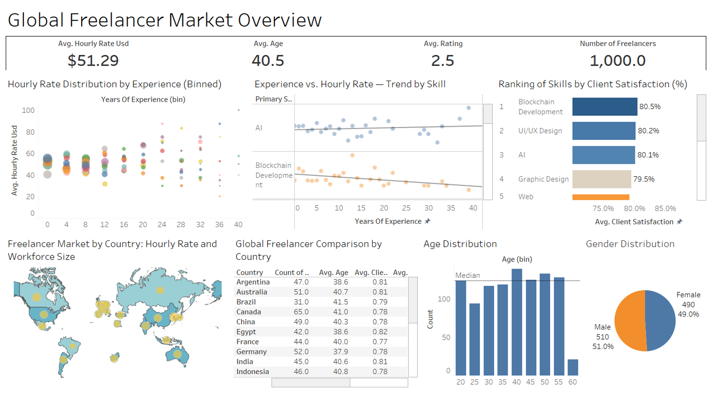

# Freelancer Market Performance

Interactive Tableau dashboard exploring freelancer **rates**, **experience**, **skills**, and **geography**.

**Live dashboard**
➡️ https://public.tableau.com/views/global_freelancers_project/GlobalFreelancerMarketOverview?:language=en-US&publish=yes&:sid=&:redirect=auth&:display_count=n&:origin=viz_share_link

## Tableau Dashboard – What’s inside
- KPIs: Avg hourly rate, avg age, avg rating, number of freelancers
- Skill ranking by client satisfaction
- Experience vs. rate (distribution + trend by skill)
- Country view: map (rate heat + workforce size) and summary stats
- Demographics: age histogram, gender proportion

---

## Data & Cleaning
  
- **Cleaned dataset:** [`global_freelancers_cleaned.csv`](global_freelancers_cleaned.csv)  
- **SQL cleaning script:** [`data_cleaning.sql`](data_cleaning.sql)

**The Cleaning workflow**
- Standardized categorical fields and trimmed strings
- Converted rate/percent fields to numeric
- Median imputation for missing numerics
- Duplicate checks with window functions

---

